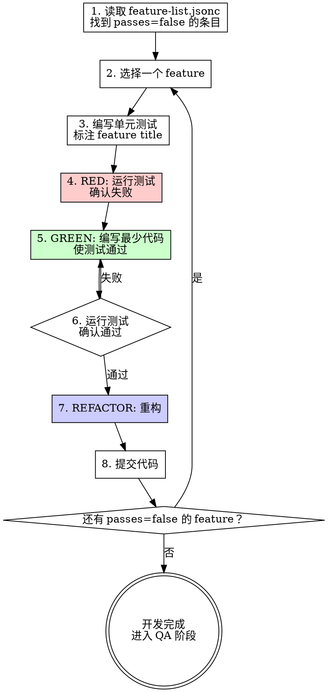

# Feature List Dev — 基于 Feature List 的 TDD 开发

## Overview

以 feature-list.jsonc 为驱动，使用 TDD 开发每个 feature。单元测试必须标注对应的 feature title，开发完成后标记 `passes: true`。

**核心原则：** feature list 是开发的 source of truth。每个单元测试都能追溯到一个 feature。

**前置要求：** 使用 feature-list-pm skill 创建了 feature-list.jsonc，或项目中已存在该文件。

## 开发流程



## 单元测试标注规范

**每个测试必须在描述中包含 feature title**，格式为 `[Feature: <title>]`：

```typescript
// TypeScript / Jest
describe('[Feature: New chat button creates a fresh conversation]', () => {
  test('should create a new conversation when button is clicked', () => {
    // ...
  });
  test('should show welcome state in chat area', () => {
    // ...
  });
});
```

**为什么标注：**
- 单元测试 → feature 的可追溯性
- 快速定位某个 feature 的测试覆盖情况
- `grep -r "Feature: " tests/` 即可查看所有 feature 的测试分布

## 开发单个 Feature 的步骤

### 1. 读取 feature 定义

```bash
# 查找所有未通过的 feature
grep -l '"passes": false' **/feature-list.jsonc
```

阅读目标 feature 的 title 和 steps，理解完整的验收标准。

### 2. 编写失败测试（RED）

- 根据 feature 的 steps 拆分为若干单元测试
- 每个测试描述中标注 `[Feature: <title>]`
- 测试应该覆盖 steps 中描述的核心行为
- **不是每个 step 都需要一个单元测试** — steps 是 e2e 视角，单元测试关注内部逻辑

### 3. 运行并确认失败

```bash
# 运行测试，确认因"功能未实现"而失败
npm test -- --testPathPattern="<test-file>"
```

测试必须因为功能不存在而失败，不是因为语法错误。

### 4. 编写最少代码（GREEN）

只写刚好能让测试通过的代码。遵循 TDD 的 test-driven-development skill。

### 5. 重构（REFACTOR）

保持测试绿色，优化代码结构。

### 6. 提交代码

单元测试通过后提交代码。**注意：此时不标记 `passes: true`。** `passes` 状态由 QA 阶段在 e2e 测试通过后统一标记。

## 与 TDD Skill 的关系

本 skill 在 test-driven-development skill 的基础上增加了：

| TDD Skill | 本 Skill 增加 |
|-----------|--------------|
| 先写失败测试 | 测试标注 feature title |
| 最少代码通过 | 以 feature-list.jsonc 为驱动 |
| 重构 | passes=true 由 QA 阶段标记 |

**不冲突，是互补。** 本 skill 提供了"测什么"的结构，TDD skill 提供了"怎么测"的纪律。

## Red Flags — 停下来

- 编码但没有对应的 feature list 条目
- 单元测试没有标注 feature title
- 标记 `passes: true` 但 e2e 测试实际没跑过
- 跳过 feature 直接编码（"这个太简单不需要 feature"）
- feature list 中不存在的功能出现在代码中

**以上情况 = 先更新 feature list，再继续开发。**

## 完成标志

- 所有目标 feature 的单元测试通过
- 每个测试都标注了对应的 feature title
- 代码已提交
- **`passes` 仍为 `false`** — 等待 QA 阶段 e2e 测试通过后标记
- 可以进入 feature-list-qa skill 设计 e2e 测试
