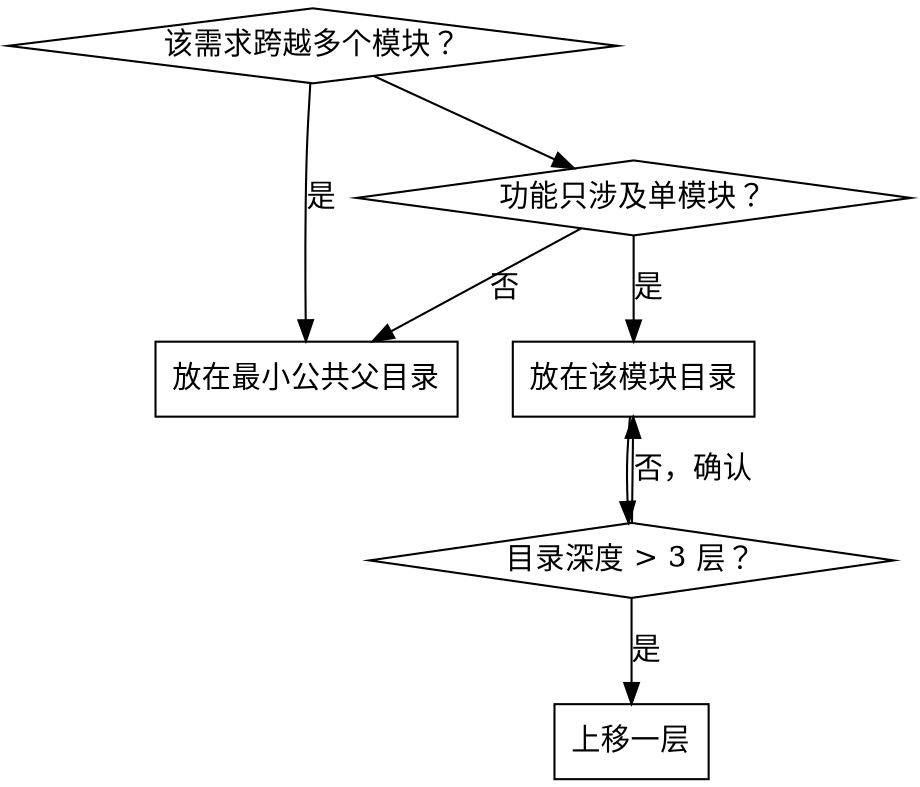

# Feature List PM — 需求分析与 Feature 定义

## Overview

在开始编码之前，先将需求拆解为可测试的 feature 条目，写入 `feature-list.jsonc`。每个 feature 包含端到端验证步骤和通过状态。

**核心原则：** 没有写进 feature list 的需求 = 不存在的需求。先定义，再开发。

## 什么是 feature-list.jsonc

位于项目各模块目录下的 JSON with Comments 文件，描述该目录下代码的所有 feature：

```jsonc
[
  {
    "category": "functional",          // functional | ui | performance | security | accessibility
    "title": "New chat button creates a fresh conversation",
    "steps": [
      "Navigate to main interface",
      "Click the 'New Chat' button",
      "Verify a new conversation is created",
      "Check that chat area shows welcome state",
      "Verify conversation appears in sidebar"
    ],
    "e2e-test-case-name": [],          // 由 QA 阶段填写
    "passes": false
  }
]
```

## 渐进式策略

旧项目可能不存在 feature list。**不要**为旧代码补写完整的 feature list。规则：

- 新需求 → **必须**创建/更新 feature-list.jsonc
- 修改已有功能 → 在对应 feature-list.jsonc 中追加或修改条目
- 不涉及的旧功能 → 不动

## 文件放置位置



**原则：** 不过深（文件描述不了完整 feature），不过浅（一个文件太庞大）。目标：每个 feature-list.jsonc 包含 3-20 个 feature。

## 操作流程

收到新需求后：

1. **理解需求** — 与用户确认需求范围和验收标准
2. **定位文件** — 确定 feature-list.jsonc 应放在哪个目录（参考上方放置规则）
3. **查找已有文件** — `find . -name "feature-list.jsonc"` 看是否已有
4. **拆分 feature** — 将需求拆解为独立的、可测试的 feature 条目
5. **编写条目** — 填写 category、title、steps，设置 `passes: false`，`e2e-test-case-name: []`
6. **与用户确认** — 展示 feature list 让用户审核
7. **保存文件** — 写入 feature-list.jsonc

## Feature 拆分原则

| 原则 | 好 | 坏 |
|------|----|----|
| **一个 feature = 一个可验证的用户行为** | "用户可以通过邮箱登录" | "实现登录功能" |
| **steps 是端到端的** | 从用户操作到可观察结果 | 只描述技术实现 |
| **title 是自然语言** | "Clicking logout clears session and redirects to login" | "logout handler" |
| **粒度适中** | 3-8 个 steps | 1 个或 20+ 个 steps |

## Steps 编写要求

每个 step 应当是一个可由人或自动化工具执行的动作或断言：

- **动作：** "Click the 'Submit' button"、"Enter 'test@example.com' in email field"
- **断言：** "Verify success toast appears"、"Check URL changed to /dashboard"
- **前置条件：** 第一个 step 应包含导航或状态设置

## Category 类型

| Category | 用途 |
|----------|------|
| `functional` | 核心业务逻辑 |
| `ui` | 界面交互和样式 |
| `performance` | 性能相关指标 |
| `security` | 安全和权限 |
| `accessibility` | 无障碍访问 |

## 完成标志

- feature-list.jsonc 已创建/更新
- 所有新增条目的 `passes` 为 `false`
- 用户已确认 feature list 内容
- 可以开始使用 feature-list-dev skill 进行开发
