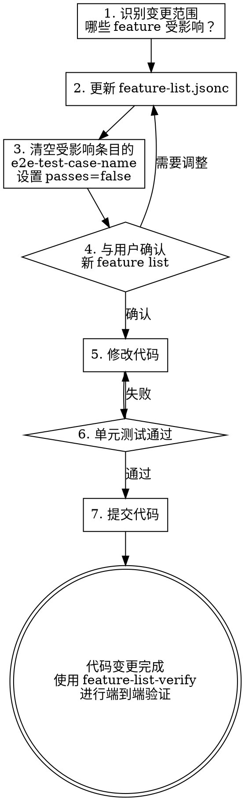

# Feature List Fix — 修复与需求变更

## Overview

当代码需要修复、需求发生变更、或需要修改已有功能时，**必须先调用本 skill**。核心动作是：先更新 feature-list.jsonc（让它反映新现实），再修改代码。

**为什么这很重要：** 如果你直接改代码而不更新 feature list，feature list 就不再是单一信息源 — 它会和代码产生漂移，后续的 verify 阶段会遗漏这些变更，最终导致功能没有被 e2e 测试覆盖。

**核心原则：** 改代码之前，先改 feature list。feature-list.jsonc 必须先于代码变更反映新需求。

## 触发场景

以下情况**必须**在改代码前调用本 skill：

- 修复 bug（无论大小）
- 需求变更（用户说"其实我想要…""改成…""不要这个功能了"）
- 修改已有 feature 的行为（steps 需要更新）
- 新增 feature（如果和现有功能相关）
- 删除 feature
- 开发过程中发现实现方式需要调整

## 操作流程



## 步骤详解

### 1. 识别变更范围

分析变更影响了哪些功能：

```bash
# 查看当前 feature list
find . -name "feature-list.jsonc" -exec cat {} \;
```

明确：
- 哪些已有 feature 的 steps 需要修改？
- 是否需要新增 feature 条目？
- 是否需要删除现有条目？
- 变更的根因是什么（bug？需求变更？技术债务？）

### 2. 更新 feature-list.jsonc

根据变更类型执行相应操作：

**修改已有 feature：** 更新 title 或 steps 以反映新行为

```jsonc
{
    "title": "User can export data as CSV",        // 原: "User can export data as JSON"
    "steps": [
      "Navigate to data view",
      "Click Export button",
      "Select CSV format from dropdown",             // 新增的 step
      "Verify CSV file downloads",
      "Check file contains correct columns"
    ],
    "e2e-test-case-name": [],                        // 需要清空
    "passes": false                                  // 需要重置
}
```

**新增 feature：** 添加新条目（参考 feature-list-new 的拆分原则）

**删除 feature：** 移除条目，同时检查是否有依赖它的其他条目

### 3. 清空受影响条目的 e2e-test-case-name

这一步不可跳过。因为代码已经变了，之前的 e2e 测试可能不再适用：

```bash
# 对受影响的 feature，清空 e2e-test-case-name 并设置 passes=false
```

**为什么不能保留旧的 e2e-test-case-name？** 旧的测试用例名指向的是基于旧行为的测试。代码变了之后，这些测试要么会失败（好的情况），要么会通过但不再验证正确行为（坏的情况，更危险）。

### 4. 与用户确认

在修改代码之前，展示更新后的 feature list 给用户审核：

- 说明改了什么（修改了哪些条目、新增/删除了什么）
- 解释为什么这样改
- 确认用户同意后再继续

**用户确认是硬性要求。** 不要跳过这一步直接改代码。

### 5. 修改代码

用户确认后，按 feature list 的新定义修改代码。遵循 TDD 原则：

- 如果修改了现有 feature，更新对应的单元测试
- 如果新增了 feature，编写新的单元测试并标注 `[Feature: <title>]`
- 如果删除了 feature，删除对应的单元测试和代码

### 6. 单元测试通过 + 提交

确认所有单元测试通过后提交代码。**`passes` 保持 `false`。**

## Red Flags — 停下来

- 直接修改代码而没有更新 feature-list.jsonc
- 修改了代码但 `e2e-test-case-name` 没有被清空
- 修改了代码但 `passes` 仍然是 `true`（应该被重置为 `false`）
- 跳过用户确认直接改代码
- "这个改动太小不需要更新 feature list" — **没有小到不需要更新的改动**

## 完成标志

- feature-list.jsonc 已更新，反映了新的需求/修复
- 受影响条目的 `e2e-test-case-name` 已清空为 `[]`
- 受影响条目的 `passes` 已设为 `false`
- 用户已确认 feature list 内容
- 代码已修改，单元测试通过
- 使用 feature-list-verify skill 进行端到端验证
