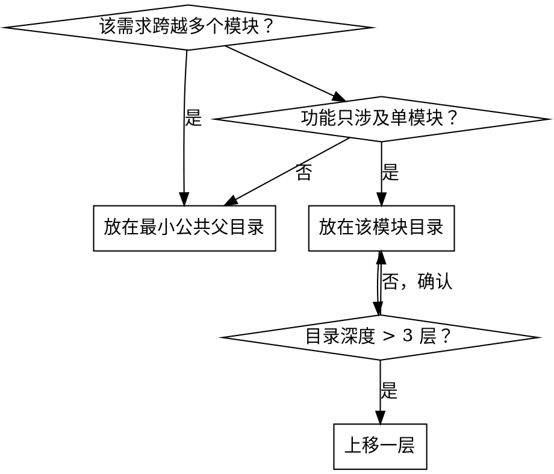

# Feature List New — 新需求开发

## Overview

开发全新功能时的完整流程：先将需求拆解为可测试的 feature 条目写入 `feature-list.jsonc`，再用 TDD 逐个实现。完成后 `passes` 保持 `false`，等待端到端验证。

**核心原则：** 没有写进 feature list 的需求 = 不存在的需求。先定义，再开发。

**前置要求：** 需求已明确，技术设计（如有）已完成。如果使用了 superpower 流程，需等 design spec 文件完成后再调用本 skill。

## 第一阶段：Feature 定义

### 什么是 feature-list.jsonc

位于项目各模块目录下的 JSON with Comments 文件，描述该目录下代码的所有 feature：

```jsonc
[
  {
    "category": "functional",          // functional | ui | performance | security
    "title": "New chat button creates a fresh conversation",
    "steps": [
      "Navigate to main interface",
      "Click the 'New Chat' button",
      "Verify a new conversation is created",
      "Check that chat area shows welcome state",
      "Verify conversation appears in sidebar"
    ],
    "e2e-test-case-name": [],          // 由 verify 阶段填写
    "passes": false
  }
]
```

### 渐进式策略

旧项目可能不存在 feature list。**不要**为旧代码补写完整的 feature list。规则：

- 新需求 → **必须**创建/更新 feature-list.jsonc
- 修改已有功能 → 使用 **feature-list-fix** skill
- 不涉及的旧功能 → 不动

### 文件放置位置



**原则：** 不过深（文件描述不了完整 feature），不过浅（一个文件太庞大）。目标：每个 feature-list.jsonc 包含 3-20 个 feature。**不能**放置在根目录下。

### Feature 拆分原则

| 原则 | 好 | 坏 |
|------|----|----|
| **一个 feature = 一个可验证的用户行为** | "用户可以通过邮箱登录" | "实现登录功能" |
| **steps 是端到端的** | 从用户操作到可观察结果，每一步的用户操作 | 任何有关技术实现，新增/修改些文件，单元测试等 |
| **title 是自然语言** | "Clicking logout clears session and redirects to login" | "logout handler" |
| **粒度适中** | 3-8 个 steps | 1 个或 20+ 个 steps |

### Steps 编写要求

每个 step 应当是一个可由人或自动化工具执行的动作或断言：

- **动作：** "Click the 'Submit' button"、"Enter 'test@example.com' in email field"
- **断言：** "Verify success toast appears"、"Check URL changed to /dashboard"
- **前置条件：** 第一个 step 应包含导航或状态设置

### Category 类型

| Category | 用途 |
|----------|------|
| `functional` | 核心业务逻辑 |
| `ui` | 界面交互和样式 |
| `performance` | 性能相关指标 |
| `security` | 安全和权限 |

### 定义阶段操作流程

1. **理解需求** — 与用户确认需求范围和验收标准
2. **定位文件** — 确定 feature-list.jsonc 应放在哪个目录（参考上方放置规则）
3. **查找已有文件** — `find . -name "feature-list.jsonc"` 看是否已有
4. **拆分 feature** — 将需求拆解为独立的、可测试的 feature 条目
5. **编写条目** — 填写 category、title、steps，设置 `passes: false`，`e2e-test-case-name: []`
6. **与用户确认** — 展示 feature list 让用户审核
7. **保存文件** — 写入 feature-list.jsonc

**完成后进入第二阶段：TDD 开发。**

---

## 第二阶段：TDD 开发

第一阶段完成后，逐个 feature 进行 TDD 开发。

**使用 test-driven-development skill** 来指导具体的 TDD 流程（RED → GREEN → REFACTOR）。本 skill 提供的是"测什么"（feature list 中的 steps），TDD skill 提供的是"怎么测"。

### 本阶段新增的约束

在 TDD skill 的基础上，本 skill 要求：

1. **单元测试必须标注 feature title** — 格式为 `[Feature: <title>]`，用于追溯：
   ```typescript
   describe('[Feature: New chat button creates a fresh conversation]', () => {
     test('should create a new conversation when button is clicked', () => { /* ... */ });
   });
   ```
2. **逐个 feature 推进** — 从 `grep -l '"passes": false' **/feature-list.jsonc` 获取待开发列表，每完成一个提交一次
3. **不标记 passes: true** — passes 由 verify 阶段在 e2e 测试通过后统一标记

### Red Flags — 停下来

- 编码但没有对应的 feature list 条目
- 单元测试没有标注 feature title
- 跳过 feature 直接编码
- feature list 中不存在的功能出现在代码中
- 开发过程中发现需求需要调整 — **使用 feature-list-fix skill**

## 完成标志

- feature-list.jsonc 已创建/更新，用户已确认
- 所有目标 feature 的单元测试通过且标注了 feature title
- 代码已提交
- **`passes` 仍为 `false`**
- 使用 feature-list-verify skill 进行端到端验证
