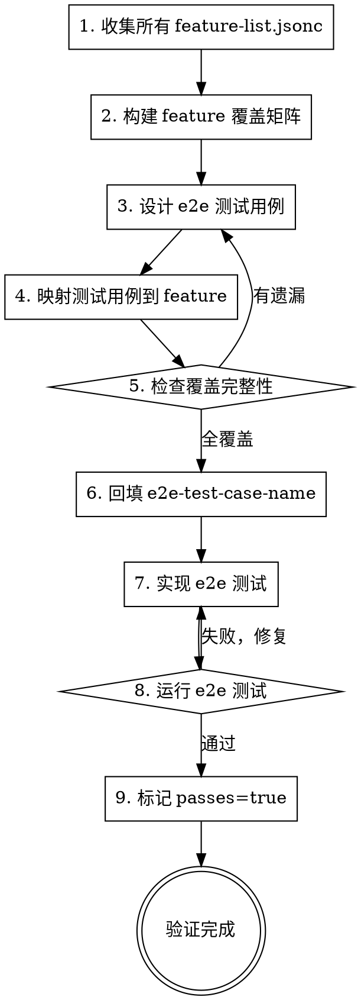

# Feature List Verify — 端到端验证

## Overview

在 feature-list-new 或 feature-list-fix 完成后（单元测试全部通过），设计并运行端到端测试，确保每个 feature 真正在用户视角下可用。**e2e 测试通过后**，回填 `e2e-test-case-name` 并标记 `passes: true`。

**核心原则：** `passes: true` 意味着该 feature 已通过端到端验证 — 不仅仅是单元测试通过，而是用户能看到、能操作、能得到预期结果。

**前置要求：** 单元测试全部通过，代码已提交。

## 前置检查

```bash
# 单元测试全部通过
npm test  # 或项目对应的测试命令

# 查看哪些 feature 待验证
grep '"passes": false' **/feature-list.jsonc
```

## 工作流程



## 测试用例设计原则

### 一个测试用例可以覆盖多个 feature

```jsonc
// e2e test: "test-user-registration-flow"
// 覆盖了：
// - "User can fill registration form"
// - "Email validation shows error for invalid input"
// - "Successful registration redirects to dashboard"
```

### 每个 feature 至少被一个测试用例覆盖

设计完成后检查：

```bash
# 查找 e2e-test-case-name 为空数组的条目
grep -A1 '"e2e-test-case-name"' **/feature-list.jsonc | grep '\[\]'
# 预期：无输出
```

### 测试用例名要有意义

| 好 | 坏 |
|----|----|
| `test-user-login-with-email` | `test-1` |
| `test-chat-message-send-and-receive` | `test-chat` |
| `test-session-timeout-redirect` | `test-auth-misc` |

## 覆盖矩阵

设计测试用例时，先构建覆盖矩阵：

```markdown
| Feature Title | e2e Test Case |
|---------------|---------------|
| User can login with email | test-user-login-with-email |
| User can login with Google | test-user-login-with-google |
| Failed login shows error | test-user-login-with-email, test-user-login-with-google |
| Session persists on refresh | test-session-persistence |
```

确保矩阵中每个 feature 至少有一个测试用例，无空行。

## 回填 feature-list.jsonc

设计完成后，将测试用例名填入 `e2e-test-case-name`（此时 `passes` 仍为 `false`）：

```jsonc
{
    "title": "User can login with email",
    "e2e-test-case-name": [
        "test-user-login-with-email"
    ],
    "passes": false  // e2e 测试通过后才改为 true
}
```

## e2e 测试编写指导

每个 e2e 测试应直接参考 feature 的 steps：

```typescript
// test-user-login-with-email.spec.ts
// Covers: [Feature: User can login with email]
test('user can login with email', async ({ page }) => {
    // Step 1: Navigate to login page
    await page.goto('/login');

    // Step 2: Enter email and password
    await page.fill('[data-testid="email"]', 'user@example.com');
    await page.fill('[data-testid="password"]', 'password123');

    // Step 3: Click login button
    await page.click('[data-testid="login-button"]');

    // Step 4: Verify redirect to dashboard
    await expect(page).toHaveURL('/dashboard');

    // Step 5: Verify user name displayed
    await expect(page.locator('[data-testid="user-name"]')).toBeVisible();
});
```

**注意：** e2e 测试的步骤应与 feature-list.jsonc 中的 steps 一一对应。steps 本身就是 e2e 测试的自然语言版本。

### CLI 应用的 e2e 测试

对于命令行工具，e2e 测试验证完整的命令执行流程：

```typescript
// test-cli-export-csv.spec.ts
// Covers: [Feature: Export command generates CSV from database]
import { execSync } from 'child_process';
import { readFileSync, unlinkSync } from 'fs';

describe('[Feature: Export command generates CSV from database]', () => {
    const outputFile = '/tmp/test-export.csv';

    afterEach(() => {
        try { unlinkSync(outputFile); } catch {}
    });

    test('exports data to CSV format', () => {
        // Step 1: Run export command with valid arguments
        const result = execSync(
            `node cli.js export --format csv --output ${outputFile} --table users`,
            { encoding: 'utf-8' }
        );

        // Step 2: Verify command exits successfully
        // (execSync throws on non-zero exit)

        // Step 3: Verify output file exists and has content
        const content = readFileSync(outputFile, 'utf-8');
        expect(content).toContain('id,name,email');

        // Step 4: Verify CSV headers match table schema
        const headers = content.split('\n')[0];
        expect(headers).toBe('id,name,email,created_at');

        // Step 5: Verify stdout shows success message
        expect(result).toContain('Exported 10 rows to');
    });
});
```

## 标记 passes=true

**只有当 e2e 测试通过后**，才将对应 feature 的 `passes` 改为 `true`：

```bash
# 运行 e2e 测试
npx playwright test  # GUI 应用
# 或
npm run test:e2e     # CLI 应用
# 或项目对应的 e2e 测试命令
```

确认全部通过后，更新 feature-list.jsonc：

```jsonc
{
    "title": "User can login with email",
    "e2e-test-case-name": [
        "test-user-login-with-email"
    ],
    "passes": true  // e2e 测试通过，可以标记
}
```

**逐个标记：** 哪个 feature 的 e2e 测试通过了就标记哪个，不要批量标记未验证的 feature。

## Red Flags — 停下来

- 跳过 e2e 测试直接标记 `passes: true`
- 批量标记未验证的 feature
- e2e 测试没有覆盖 feature-list.jsonc 中的所有 feature
- `e2e-test-case-name` 为空数组的条目仍然存在

## 完成标志

- 覆盖矩阵中每个 feature 都有对应的 e2e 测试用例
- 所有 feature-list.jsonc 的 `e2e-test-case-name` 已回填
- e2e 测试已编写并全部通过
- 通过的 feature 已标记 `passes: true`
- 无 `e2e-test-case-name: []` 的条目存在
